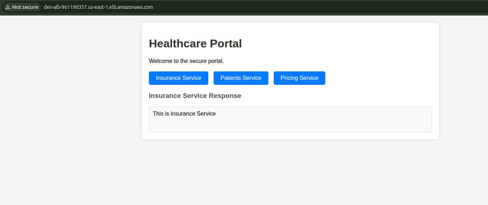
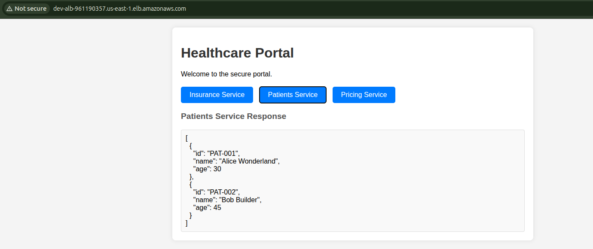
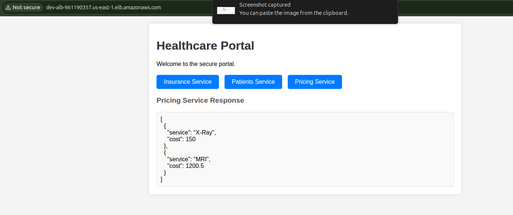
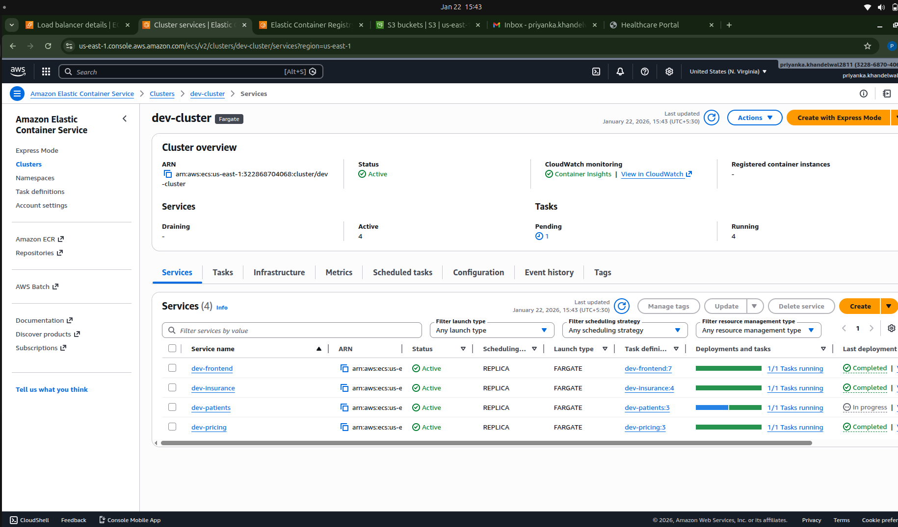
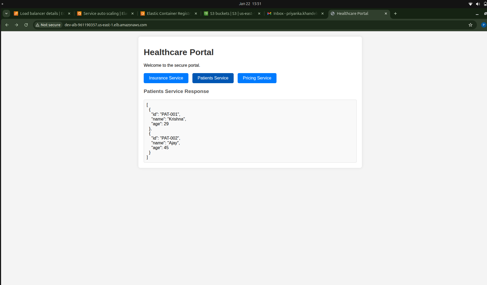
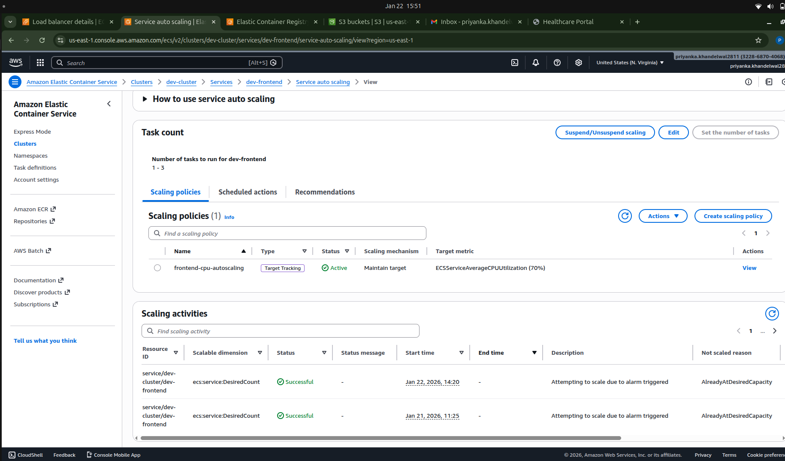

# Scalable Healthcare Portal

A microservices-based healthcare portal deployed on AWS using ECS Fargate, Terraform, and Docker.

## Folder Hierarchy

### 1. .aws 

Contains a script to create backend s3 buckect for state file

### 2. .github/workflows

Contains deployment workflows to deploy frontend and other services

### 3. modules

Reusable Terraform Modules for ALB, ECS, ECR, VPC, Security groups, Subnets, NAT.

### 4. src 

Contains Application Source Code, Frontend and Backend services with there docker files

### 5. terraform

#### a. infrastructure

contains base Layer (VPC, ALB, ECR, Security Groups)

#### b. services

Contains application Layer (ECS Services, Task Definitions)


## Architecture

Architecture is divided into two part - 

### 1. Public Subnet - 
- This is the "Front Door". It accepts traffic from the internet 
- Resources in the Public Subnet - ALB, NAT Gateway, Internet Gateway

### 2. Pricate Subnet - 
- Runs the actual application code (Frontend, Insurance, Patients, Pricing services).
- Resources in the Private Subnet - ECS Fargate Tasks (Containers).
- It only accepts the traffic from ALB

## Traffic Flow
- User visits to LB's URL
- ALB received request on Port 80
- Listen Rule check path: Does it start with /insurance ? -->  Yes
- ALB forwards request to Target Group (ex - insurance-tg).
- Target Group picks a healthy Container running in the Private Subnet (e.g., on port 3001).
- Container processes request and responds.

## How to Use

### Prerequisites

Ensure you have the following installed and configured:
- **AWS CLI** (Configured with credentials)
- **Terraform** 

### 1. Infrastructure Setup (Terraform)

- The infrastructure is split into two layers Networking, security, ECR, ECS is a first section

- Application resources in a second section. This section is direclty trigger from deployement workflow.

**Step 1: Deploy Base Infrastructure**
This sets up the VPC, Load Balancer, and ECR repositories.
```
cd terraform/infrastructure
terraform init
terraform plan
terraform apply
```

**Step 2: Deploy Application Services**
This deploys the ECS services and connects them to the infrastructure. (It is triggered from deployment workflow)

### 2. Accessing the Application

- Once deployed, the application is accessible via the Application Load Balancer (ALB) URL.

- Frontend page having three buttons of three service with shows the backend data then you click a perticular service button 


`NOTE - I have created dummy backend services for this assessment as the main focus is on the pipelines and infrastructure design.`


## Testing Screenshots -

### Initial Deployments -
 
 
 

[Frontend Inital Deployment](https://github.com/krushna1512/ks-healthcare/actions/runs/21243861336)

[Insurance Service Inital Deployment](https://github.com/krushna1512/ks-healthcare/actions/runs/21243300038)

[Patients Service Inital Deployment](https://github.com/krushna1512/ks-healthcare/actions/runs/21244338876)

[Pricing Service Inital Deployment](https://github.com/krushna1512/ks-healthcare/actions/runs/21244346491)

### Rolling Updates - 
 
 
[Patients Service Rolling Deployment](https://github.com/krushna1512/ks-healthcare/actions/runs/21244501910)

### Autoscaling 
 